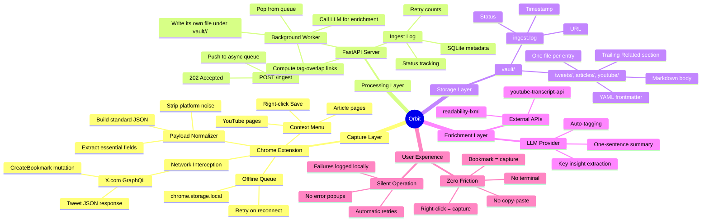

# ORBIT PROTOCOL

## 1. Purpose

This document defines the canonical data structure, file format, and routing rules for every piece of content captured by Orbit. It is the single source of truth for both the Chrome Extension (capture layer) and the Python server (processing layer).

---

## 2. YAML Frontmatter Schema

Every captured bookmark is appended to a Markdown file with the following YAML frontmatter block. This structure is deterministic, machine-readable, and optimized for LLM retrieval.

Frontmatter is serialized by PyYAML (`yaml.safe_dump`), so quoting follows
YAML's own rules rather than a fixed template — a title needing no quotes
appears bare, and lists render in block style:

```yaml
---
id: <uuid-v4>
type: <tweet | thread | youtube | article | podcast>
source_url: <canonical URL>
source_platform: <x | youtube | medium | substack | other>
author: <display name or channel name>
author_handle: '<@handle or channel slug>'
title: <tweet first line, video title, or article headline>
captured_at: <ISO 8601 timestamp>
published_at: <original publish date if available, else null>
tags:
- <auto-extracted>
- <topic>
- <concept>
summary: <one-sentence LLM-generated summary, or null>
key_insights:
- <insight 1>
- <insight 2>
status: <ingested | enriched | failed>
---
```

Block-style and flow-style lists (`tags: [a, b]`) are the same YAML; any parser
reads them identically. Don't hand-write frontmatter — go through
`format_bookmark_entry()`, which is the only thing that gets the escaping right.

### Field Definitions

| Field | Type | Required | Source | Notes |
|---|---|---|---|---|
| `id` | string (UUID) | Yes | Generated by server | Per-entry handle. **Not** a dedup key — see §2b |
| `type` | enum | Yes | Server (from URL) | Determines which template and pipeline to use |
| `source_url` | string (URL) | Yes | Extension | Canonical link back to original |
| `source_platform` | enum | Yes | Server (from URL) | Used for routing and filtering |
| `author` | string | Yes | Extension or API | Display name |
| `author_handle` | string | Yes | Extension | Normalized handle/slug |
| `title` | string | Yes | Extension or API | First line for tweets, title for articles/videos |
| `captured_at` | string (ISO 8601) | Yes | Extension | When the user bookmarked it |
| `published_at` | string (ISO 8601) | No | Extension or API | Original publish timestamp |
| `tags` | array[string] | Yes | LLM enrichment | Auto-extracted topics; empty array if enrichment skipped |
| `summary` | string or null | No | LLM enrichment | One-sentence distillation |
| `key_insights` | array[string] | No | LLM enrichment | Bullet-point takeaways |
| `status` | enum | Yes | Server | Tracks processing state — see §2a |

---

## 2a. What `status` Actually Means

The status field is a claim about the entry, and it is only ever written to
match what happened:

| Status | Meaning |
|---|---|
| `ingested` | Captured, extracted, and written to the vault — but **not** enriched. `tags`, `summary`, and `key_insights` are empty. Either the LLM was unavailable (missing/invalid key) or there was no content to analyze. |
| `enriched` | The LLM returned structured output. Tags and summary are real. |
| `failed` | Processing raised on every attempt. A stub entry preserves the URL so nothing is lost. |

`processing` and `retrying` also appear in the SQLite log as transient states,
but never in the vault.

An entry marked `enriched` with empty tags is a bug, not a normal outcome. If
you see one, the enrichment call is failing silently somewhere.

---

## 2b. Deduplication

Deduplication keys on the **normalized source URL**, not on `id`. A randomly
generated UUIDv4 minted per ingest cannot dedupe anything — re-bookmarking the
same tweet would simply mint a second UUID.

`normalize_url()` reduces a URL to a stable identity by:

- collapsing YouTube to its video id, so `youtu.be/ID`, `/shorts/ID`, and
  `watch?v=ID&t=42` are one thing
- collapsing X status URLs to `x.com/status/<id>`, since the handle in the path
  is cosmetic and `twitter.com` is the same site
- stripping tracking parameters (`utm_*`, `si`, `ref`, `fbclid`, …), the
  fragment, `www.`, and a trailing slash

The normalized value is stored in the `normalized_url` column of the ingest
log. `POST /ingest` returns `{"status": "duplicate"}` without queueing when a
URL has already been captured.

---

## 3. Markdown Body Template

After the frontmatter, the raw content is rendered in a consistent Markdown structure:

```markdown
## Content

<Full tweet text, article body, or video transcript>

## Context

- **Original URL:** <source_url>
- **Captured:** <captured_at>
- **Platform:** <source_platform>

---
```

Each bookmark entry is separated by a horizontal rule (`---`) for clean visual and programmatic parsing.

---

## 4. File Organization

One file per entry, grouped by type into subfolders:

```
vault/
  tweets/       <slug>-<id8>.md      # tweets and threads
  articles/     <slug>-<id8>.md
  youtube/      <slug>-<id8>.md      # frontmatter type: youtube
  ingest.log                          # SQLite metadata log (not human-readable)
  videos/                             # Local MP4s — only when ORBIT_DOWNLOAD_VIDEOS=1
```

This exists to make the vault an Obsidian vault, not just a folder Obsidian
can open. Obsidian's graph view draws an edge for every `[[wikilink]]`
between two *files* — the original design (two append-only files, one entry
appended after another) had no files to link between, so the graph would
have shown two disconnected dots no matter how much was captured.

The vault is gitignored. It's personal reading data, the pipeline rewrites it
on every run, and video files run to hundreds of megabytes. Back it up
separately.

### The filename

`<slug>-<id8>.md`, where `<slug>` comes from the title (or the source domain,
if the title is empty) and `<id8>` is the first 8 hex characters of the
entry's UUID — enough to make the filename unique, not a second identity. The
full UUID stays the canonical one, in frontmatter, unchanged.

The filename is set once and never renamed, even if the title later changes
(e.g. a YouTube placeholder title gets replaced by the real one from
metadata). Once something — a manual note, an Obsidian link — might point at
a filename, silently renaming it out from under that reference would be a
worse outcome than living with an occasionally-stale slug.

### Auto-linking

Every write computes which existing entries share enrichment tags with the
new one and appends a trailing `## Related` section linking to them:

```markdown
## Related

- [[the-compounding-interest-of-writing-a1b2c3d4|The compounding interest of writing]]
```

This is deliberately the cheap version of "connections." It only sees exact
tag string matches — two entries about the same idea tagged `pkm` and
`personal-knowledge-management` respectively won't link, and with a small,
LLM-tagged vault it is common for very few (or zero) entries to share a tag
at all. A real semantic version (nearest-neighbor over embeddings, already
partially built as an unused Chroma index) is future work; this is what
ships now, and it degrades gracefully — an unenriched entry has no tags and
therefore no links, and gains them automatically the moment it's enriched.

Only the linking file needs to be written: Obsidian's backlinks panel
surfaces the reverse direction automatically for any note that's linked
*to*, and the graph draws the edge regardless of which file caused it. Older
entries don't get rewritten when a new one could link to them — that's what
`rebuild_related_links()` in `server.py` is for, run wholesale by both
`migrate_to_obsidian.py` and `backfill.py` after either changes tags on a
scale a single new write wouldn't reach.

---

## 5. Orbit Ecosystem — Mind Map



---

## 6. Why This Structure? (Conversational Walkthrough)

Hey — let me walk you through *why* we're organizing data this way, because the structure is the product.

### The YAML Frontmatter

Think of YAML frontmatter as a **passport** for each piece of content. When an LLM (or Obsidian, or you) reads a vault entry later, it doesn't need to parse the entire body to understand what it's looking at. The frontmatter gives it structured metadata upfront: *what is this, who wrote it, when was it captured, what topics does it cover?*

This matters because LLMs are expensive to run and limited in context. If you ask "what did I save about distributed systems last month?", the LLM can scan just the `tags` and `captured_at` fields in the frontmatter — it doesn't need to read every word of every bookmark. It's the difference between reading a library's card catalog versus walking every shelf.

### The `type` and `source_platform` Split

You might wonder why we have both `type` and `source_platform`. Here's the distinction:

- **`type`** describes the *format*: is it a single tweet, a thread, a YouTube video, or a long-form article? This determines how the LLM should process it.
- **`source_platform`** describes the *origin*: did it come from X, YouTube, Medium? This matters for routing and filtering.

A YouTube video and a podcast episode might both be `type: video` but have different `source_platform` values. A tweet and a thread are both from X but need different processing.

### The `status` Field

This is our **audit trail**. Every bookmark goes through stages:

1. `ingested` — the server received it and wrote it to disk
2. `enriched` — the LLM has added tags, summary, and insights
3. `failed` — something went wrong (logged, will retry)

If your server crashes mid-processing, the `status` field tells you exactly where each bookmark is in the pipeline. No data is lost, nothing is duplicated.

### The Mind Map

The mind map above is the **entire Orbit ecosystem** in one view. Here's what each branch means:

- **Capture Layer** — everything that happens in your browser. The extension intercepts bookmarks, normalizes the data, and ships it to the server. If the server is down, it queues locally.
- **Processing Layer** — the Python server. It receives data, queues it, enriches it with an LLM, and writes it to disk safely with file locks.
- **Storage Layer** — your vault. One markdown file per entry, grouped by type. No database, no cloud, just plain text on your machine — and, because it's one file per entry, an Obsidian vault as-is.
- **Enrichment Layer** — the intelligence. LLMs add structure and meaning. External APIs pull in transcripts and clean article text.
- **User Experience** — the philosophy. Zero friction. You bookmark, Orbit handles the rest. No terminal, no config, no thinking.

### Why One File *Per Entry*?

Earlier versions of this document argued the opposite — one append-only file per type, for simplicity: no filenames to manage, an LLM can read everything in one context window, `git diff` shows exactly what changed.

All still true. It lost to a bigger constraint: **Obsidian's graph view draws an edge for every `[[wikilink]] between two files`.** Two giant files are two disconnected dots no matter how much they hold. If part of the point of this vault is to eventually *see* it — as a graph, as connections between ideas — the content has to live in something that can be a node.

The tradeoffs from the old approach are real and now yours to live with: filenames to think about (handled by `slugify()` + a short id suffix, see §4), a directory to navigate (small at this vault's size), and `git diff` on a change now touches one small file instead of one line in a big one — arguably an improvement, since the vault itself is gitignored anyway and this only matters for reading the pipeline's own diffs.

### The Append-Only Guarantee

Every bookmark gets its own new file, never merged into an existing one. This gives you:

- An immutable history of everything you've captured
- No risk of overwriting good data with bad
- A natural audit trail

Think of it like a journal. You don't erase entries — you add new ones.

One correction to an earlier version of this doc: append-only does *not* mean
"re-append a new version whenever something changes." Combined with URL-based
deduplication (§2b), a URL that has already been captured is skipped outright
rather than written twice. If you need to re-enrich entries that were saved as
`ingested` — say, after fixing an API key — that's a backfill operation that
rewrites entries in place, not an append.
